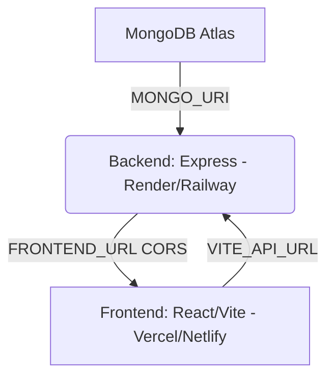

# Production Deployment Guide: Full-Stack Portfolio

This guide outlines the complete, step-by-step process to deploy your **React/Vite frontend** and **Node/Express backend** to production.



---

## 🛠️ Step 1: Database Setup (MongoDB Atlas)
Since your local MongoDB will not be accessible in production, you must set up a free cloud database using **MongoDB Atlas**.

1. Go to [MongoDB Atlas](https://www.mongodb.com/cloud/atlas) and sign up for a free account.
2. Create a new project and build a **M1 Shared Cluster** (free tier).
3. Under **Database Access**, create a database user (e.g., `db_user`) with a strong password. *Note down the password.*
4. Under **Network Access**, click **Add IP Address** and choose **Allow Access from Anywhere** (`0.0.0.0/0`). This is necessary because serverless and platform-as-a-service providers dynamically rotate their outward IPs.
5. Go to your **Cluster Dashboard**, click **Connect** -> **Connect your application**, and copy your **connection string** (SRV link).
   - It will look like: `mongodb+srv://db_user:<password>@cluster0.xxxx.mongodb.net/?retryWrites=true&w=majority`
   - Replace `<password>` with your actual database user password. This is your production `MONGO_URI`.

---

## 🚀 Step 2: Deploy the Backend API
We recommend deploying the Express backend to **Render** or **Railway** as they fully support persistent Node.js processes, dynamic port bindings, and custom filesystems.

### Option A: Deploying on Render (Free & Simple)
1. Go to [Render](https://render.com/) and sign up.
2. Connect your GitHub repository.
3. Click **New +** and select **Web Service**.
4. Choose your portfolio repository.
5. Configure the Web Service settings:
   - **Name**: `portfolio-backend`
   - **Runtime**: `Node`
   - **Root Directory**: `backend` *(Crucial: This tells Render to run inside the backend folder)*
   - **Build Command**: `npm install`
   - **Start Command**: `node server.js`
   - **Instance Type**: `Free` (or Starter for persistent disks)
6. Click **Advanced** and add the following **Environment Variables**:
   
   | Key | Value | Description |
   | :--- | :--- | :--- |
   | `NODE_ENV` | `production` | Optimizes Express performance |
   | `MONGO_URI` | *Your MongoDB Atlas connection string* | Saved from Step 1 |
   | `JWT_SECRET` | *Generate a long random string* | Secure key to sign JWTs |
   | `FRONTEND_URL` | *Your deployed Vercel URL* (e.g., `https://myportfolio.vercel.app`) | Crucial for CORS. You can temporarily set this to `*` or update it after Step 3. |

7. Click **Create Web Service**. Render will build and deploy your backend. It will provide a public URL like `https://portfolio-backend.onrender.com`.

> [!IMPORTANT]
> **A Note on Local File Storage (`uploads/`)**
> Your backend currently saves resumes and profile images locally inside the `backend/uploads/` directory. 
> - On **Free Web Services** (like Render/Railway Free), the filesystem is **ephemeral**. This means uploaded files will be lost whenever your server goes to sleep, restarts, or redeploys.
> - **Solutions**:
>   1. **Immediate (Free)**: For personal use, uploads will work fine while the server is active, but will reset upon restarts.
>   2. **Premium (Recommended for Production)**: Attach a **Persistent Disk** on Render/Railway mapped to `/opt/render/project/src/backend/uploads` so files survive restarts.
>   3. **Scale (Best Practice)**: Update `server.js` to upload assets directly to **Cloudinary** or **AWS S3** instead of storing them locally.

---

## 💻 Step 3: Deploy the Frontend (Vite SPA)
**Vercel** is the gold standard for React + Vite applications, providing instant global CDN hosting, high performance, and automatic SPA route handling.

### Deploying on Vercel
1. Go to [Vercel](https://vercel.com/) and log in.
2. Click **Add New** -> **Project**.
3. Select your portfolio GitHub repository.
4. Configure the project settings:
   - **Framework Preset**: `Vite` (automatically detected)
   - **Root Directory**: `frontend` *(Crucial: Tell Vercel to build from the frontend folder)*
   - **Build Command**: `npm run build`
   - **Output Directory**: `dist`
5. Open the **Environment Variables** accordion and add:
   
   | Key | Value | Description |
   | :--- | :--- | :--- |
   | `VITE_API_URL` | *Your deployed backend URL* (e.g., `https://portfolio-backend.onrender.com`) | **Do not add a trailing slash `/`** |

6. Click **Deploy**. Vercel will build your static assets and generate your live site URL (e.g., `https://myportfolio.vercel.app`).

### ⚠️ Critical Step: Handling SPA Router Redirects
Because React Router handles routing on the client side, if a user refreshes a page like `/dashboard` or `/u/123`, the static host (Vercel) will try to find a file at that path and return a `404 Not Found` error. 

To fix this, we need to instruct Vercel to redirect all routes to `index.html`. 

We do this by adding a `vercel.json` file inside the `frontend` folder (this file has been automatically created for you in this codebase):

#### `frontend/vercel.json`
```json
{
  "rewrites": [
    {
      "source": "/(.*)",
      "destination": "/index.html"
    }
  ]
}
```

---

## 🔗 Step 4: Synchronize CORS and Backend Config
Now that both services are deployed, ensure they are talking to each other correctly:

1. **Verify Frontend URL in Backend**:
   - Go to your Render/Railway backend environment variables.
   - Set `FRONTEND_URL` to your exact deployed Vercel URL: `https://myportfolio.vercel.app` (do not add a trailing slash).
   - This ensures the server's `CORS` middleware allows requests from your deployed frontend.
2. **Verify Backend URL in Frontend**:
   - Go to your Vercel frontend environment variables.
   - Set `VITE_API_URL` to your exact deployed backend URL: `https://portfolio-backend.onrender.com`.
   - Redeploy or trigger a new build on Vercel to apply the updated environment variable.

---

## ✅ Deployment Checklist

- [ ] MongoDB Atlas cluster is running and database user is configured.
- [ ] MongoDB network access is open (`0.0.0.0/0`).
- [ ] Backend is deployed with correct environment variables: `MONGO_URI`, `JWT_SECRET`, and `FRONTEND_URL`.
- [ ] Frontend has `vercel.json` rewrite configuration for React Router.
- [ ] Frontend is deployed with `VITE_API_URL` set to the production backend.
- [ ] Both systems are tested:
  - [ ] Registration / Login works.
  - [ ] Dashboard profile edits persist to Atlas.
  - [ ] Public shareable portfolio links (`/u/<id>`) render accurately.
  - [ ] Resumes and avatars can be successfully uploaded and rendered.
